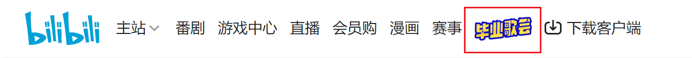
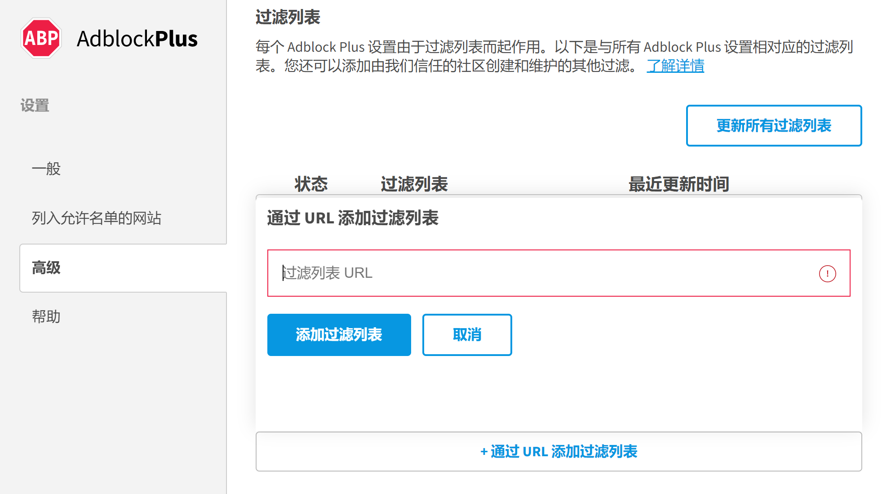
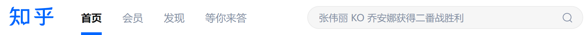
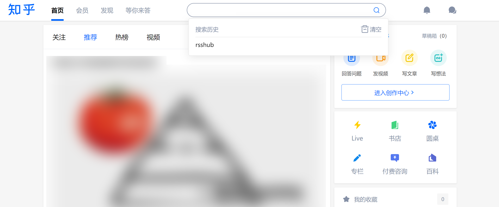
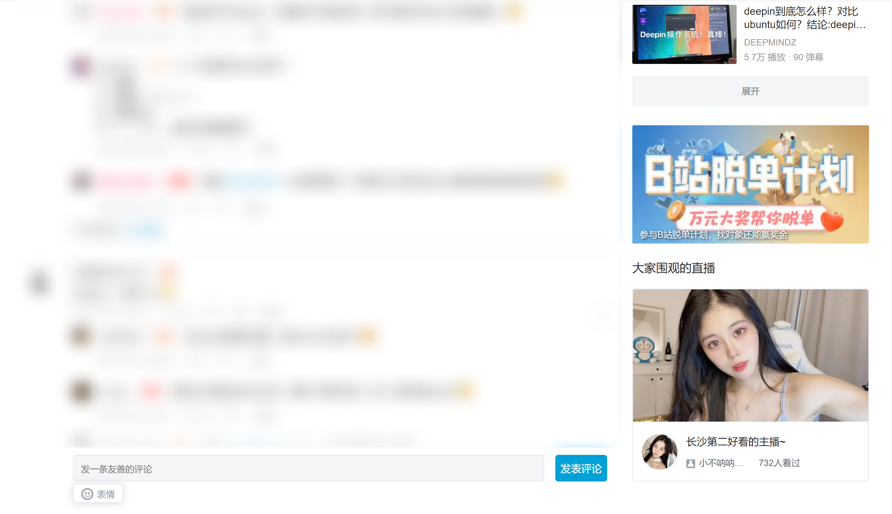
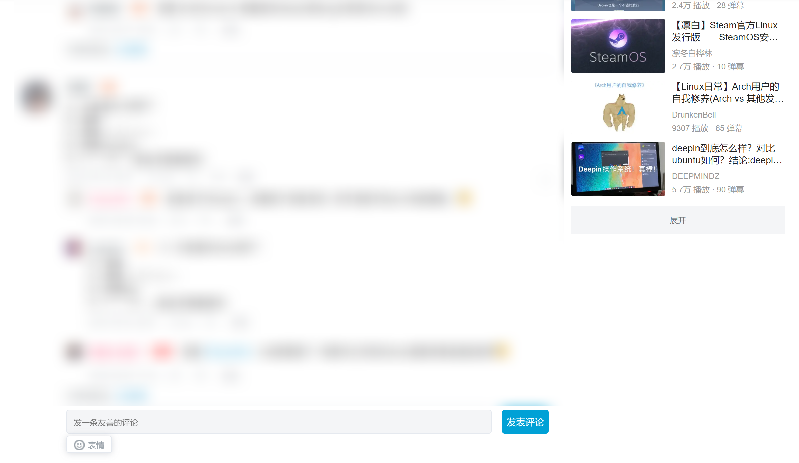

# CocoonListChina
**干掉一切简中互联网上的牛皮藓内容，减少无用信息摄入**

## 提供了哪些额外功能
1. 屏蔽站内官方广告（自带的规则仅屏蔽第三方广告）。
2. 屏蔽主流网站的热搜及其推送。
3. 屏蔽其他各种花里胡哨的无用元素，例如B站上的活动。

## 使用方法（以 Adblock Plus 为例）
1. 打开 ABP 扩展设置页面。
2. 在高级选项中，通过URL添加过滤列表，输入 `https://raw.githubusercontent.com/TigerCubDen/CocoonListChina/main/list.txt` 即可。

## 注意事项

由于插件功能受限，可能无法屏蔽所有内容。如有需要，请使用第三方脚本。

~~例如，如果您想屏蔽知乎搜索框上的“牛皮藓”：~~ (已解决)

可以使用油猴脚本 [知乎增强](https://greasyfork.org/zh-CN/scripts/419081-%E7%9F%A5%E4%B9%8E%E5%A2%9E%E5%BC%BA)。

## 效果展示

- 屏蔽知乎上的热搜

&nbsp;&nbsp;&nbsp;&nbsp;&nbsp;

 

- 屏蔽 bilibili 右侧引流栏

&nbsp;&nbsp;&nbsp;

#### *本规则虽为自用，但欢迎大家踊跃贡献。*